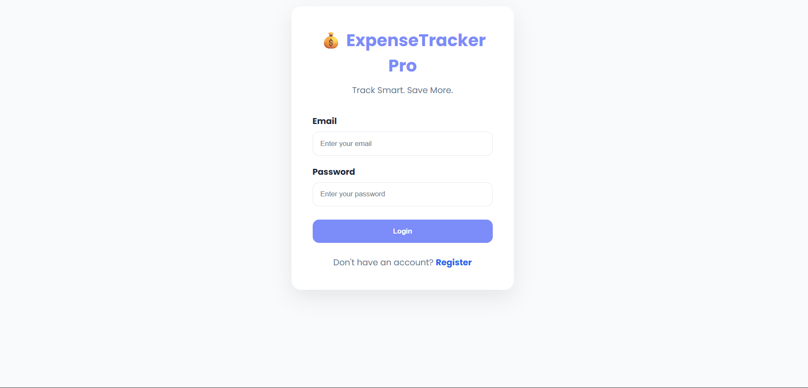
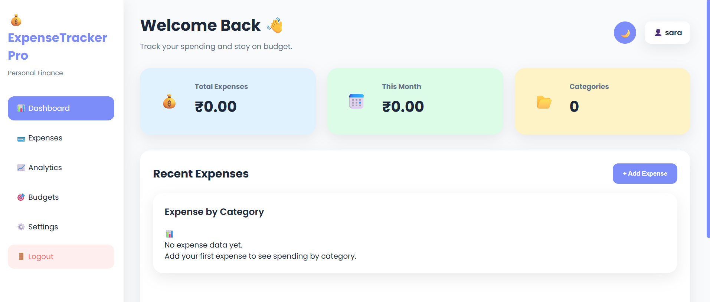
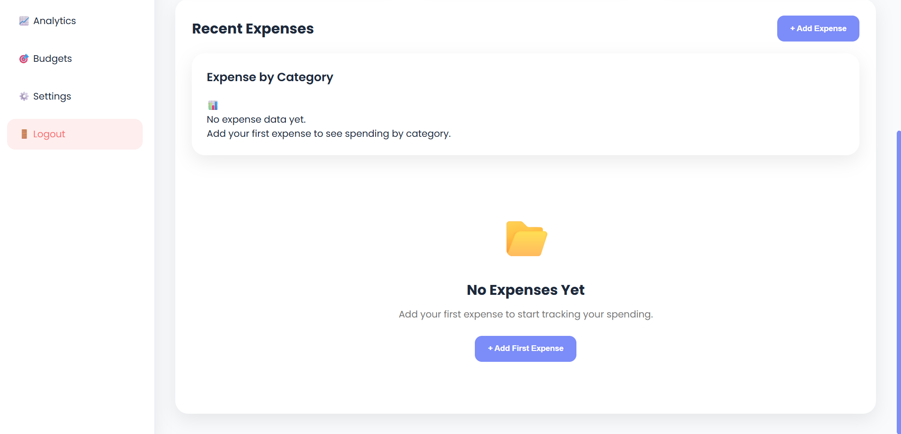
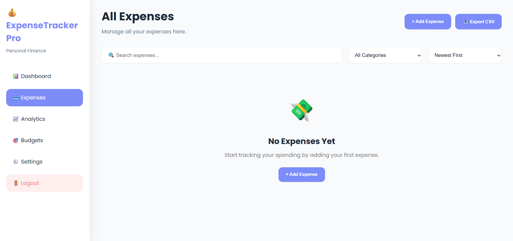
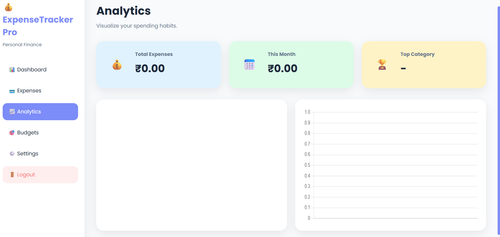
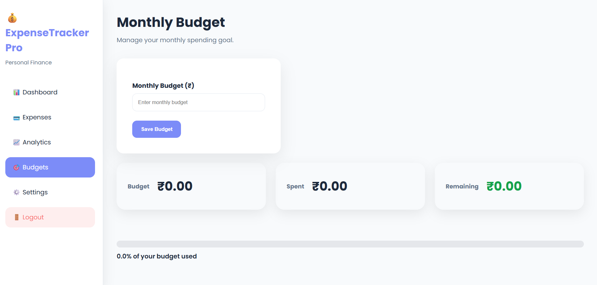
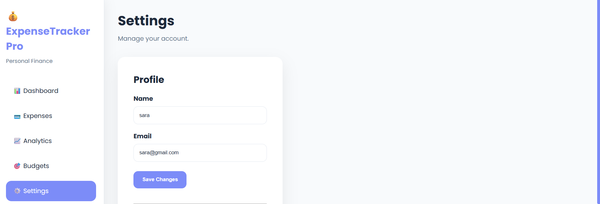
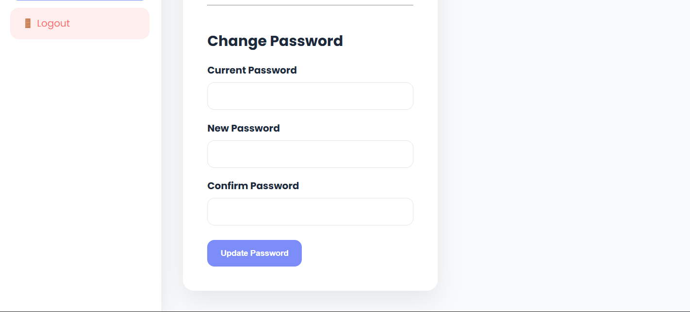

# 💸 ExpenseTracker Pro

A modern full-stack expense management application built with **Flask**, **PostgreSQL**, and **JavaScript** that helps users manage their finances through budgeting, spending analytics, and interactive dashboards.

---

## 🌐 Live Demo

**Website:** https://expensetrackerpro-3vh9.onrender.com/

---

# ✨ Features

### 🔐 Authentication

* User Registration
* Secure Login & Logout
* Password hashing using Werkzeug
* Session-based authentication
* Change Password
* Update Profile

### 💰 Expense Management

* Add Expenses
* Edit Expenses
* Delete Expenses
* Search Expenses
* Filter by Category
* Sort by Date & Amount

### 📊 Dashboard

* Total Expenses
* Monthly Spending
* Total Categories
* Expense-by-Category Pie Chart
* Empty State UI

### 📈 Analytics

* Monthly Spending Overview
* Category Distribution
* Top Spending Category
* Interactive Charts powered by Chart.js

### 🎯 Budget Management

* Set Monthly Budget
* Remaining Budget Calculation
* Budget Progress Bar
* Budget Warning Notifications

### 🎨 User Experience

* Responsive Design
* Dark Mode
* Toast Notifications
* SweetAlert Confirmation Dialogs
* Clean Modern Interface

---

# 🛠 Tech Stack

## Frontend

* HTML5
* CSS3
* JavaScript

## Backend

* Python
* Flask

## Database

* PostgreSQL (Neon)

## Libraries

* Chart.js
* SweetAlert2
* Toastify.js
* Werkzeug
* Gunicorn
* Psycopg

## Deployment

* Render

---

# 🚀 Getting Started

## Clone the repository

```bash
git clone https://github.com/apurva616/ExpenseTrackerPro
```

## Navigate into the project

```bash
cd ExpenseTrackerPro
```

## Create a virtual environment

```bash
python -m venv venv
```

## Activate the virtual environment

### Windows

```bash
venv\Scripts\activate
```

### macOS / Linux

```bash
source venv/bin/activate
```

## Install dependencies

```bash
pip install -r requirements.txt
```

## Configure Environment Variables

Create a `.env` file and add:

```text
DATABASE_URL=your_postgresql_database_url
SECRET_KEY=your_secret_key
```

## Run the application

```bash
python backend/app.py
```

---

# 📸 Screenshots

## Login



---

## Dashboard




---

## Expenses



---

## Analytics



---

## Budget



---

## Settings




---

# 📌 Future Improvements

* Export expenses to PDF/Excel
* Recurring expense reminders
* Income tracking
* Multiple currencies
* Email notifications
* AI-powered spending insights

---

# 🎯 What I Learned

While building this project I gained hands-on experience with:

* Flask application development
* PostgreSQL database integration
* User authentication and session management
* CRUD operations
* RESTful routes
* Interactive dashboards using Chart.js
* Responsive UI design
* Deployment using Render
* Version control with Git & GitHub

---

# 📄 License

This project is intended for educational and portfolio purposes.

---

## 👨‍💻 Author

**Apurva .R**

If you found this project helpful, feel free to ⭐ the repository.
